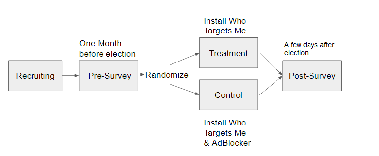

Supervisors:

Claes de Vreese
Natali Helberger
Tom Dobber

My PhD project will focus on two questions:

1. How are political ads microtargeted in practice?
2. What is the effect of being exposed to microtargeted political ads?

Paper I  and paper II focus on question 1 and paper III focuses on question 2.

# Paper I: Going Micro to Go Negative

One of the threats of political microtargeting (PMT) is that political parties or outside groups will take advantage of it to deliver manipulative messages to individuals that are most susceptible to them. Advertisers seeking to send messages that go against the norms of the general public might try to avoid detection and potential backlash effects by targeting a smaller subsection of society that is more likely to accept or be influenced by such tactics.

The key questions I seek to answer with this study:

> What role does microtargeting play for negative campaigning?

> Is microtargeting a strategy for negative campaigners to manage the risk of potential backlash effects?

So far, the literature around microtargeting has been focused on legal and ethical questions [@zuiderveen_borgesius_online_2018; @bodo_political_2017; @bennett_voter_2016; @bennett_trends_2015] and what little there is on empirical studies has concentrated on experimental methods seeking to estimate the effects of personalized microtargeted advertisements [@dobber_microtargeted_2020; @zarouali_using_2020]. The study conducted here contributes to empirical literature and more specifically the supply side of microtargeting by examining the advertisers and advertisements themselves. The study described here leverages the Facebook Ad library and Google Transparency Report, in combination, whereas previous study focused on one over the other, with a stronger focus on the Facebook Ad library) [e.g. @fowler_political_2021]. 


## Backlash Effect of Negative Campaigning

Microtargeting creates an accountability and transparency problem because it's possible to create "dark posts", manipulative advertisements targeted at a smaller fraction of a population with less people so that it flies under the radar of journalistic scrutiny [@zuiderveen_borgesius_online_2018]. The same logic could be said to apply to the usage of messages that include incivility because of the potential backlash effects of exposing the wrong people to such messages. I focus on incivility because we would expect the strongest backlash when targeted towards the wrong people and the most benefit when targeted toward the right people [@nai_is_2020]. Although challenging opponents' political views is the cornerstone of democracy, it may be claimed that uncivil ad-hominem attacks toward opponents' personal characteristics have the potential to deteriorate the quality of political discourse in general. Incivility includes language that is "disrespectful, poisonous and hyperbolic [...]", and "break[s] norms of conversation [...]" [@otto_is_2020]. @brooks_beyond_2007 define incivility as "claims that are inflammatory and superfluous" and distinguish between uncivil negative and civil negative ads. The latter being attacks that criticize the opponent but can be considered fair whereas the former are attacks that should be outside of democratic norms and contain messages attacking opponents personally, by for example alleging that they are fundamentally corrupt or evil. 


Inflammatory advertisements may have a detrimental impact on campaigns because it can make people feel more sympathetic toward the target [@walter_unintended_2019]. Researchers have first documented this *backlash effect* in the 1980ies [@garramone_voter_1984; @hill_exploration_1989], and a more recent meta-analysis of 40 studies examining negative advertisements finds 33 studies that confirm a backlash effect [@lau_negative_2009]. The backlash effect has also been found outside of the United States in multiparty environments [@walter_unintended_2019; @roy_fighting_2016].

This backlash effect is also dependent on voter (and candidate) features, for example, @krupnikov_accentuating_2015 demonstrate that backlash towards African-American attack sponsors is greater among white voters. And Nai demonstrates that people who are high in conflict avoidance significantly reduce their rating of the attack sponsor whereas individuals who are high in psychopathy traits rate the target much more negatively [@nai_is_2020].

Further, advertisers seem to be aware of potential backlash effects and take advantage of the situation when they don't have to fear it: outside groups are more likely to use negative ads when they conceal their donor information [@chand_dark_2017; @jain_facebook_2020].

## Microtargeting to Avoid Backlash

Given that advertisers seem to be aware of the risks of "going negative", microtargeting could be used as an effective strategy to mitigate potential backlash effects because negative messages can be targeted towards individuals who are most susceptible to them and accepting of them. Further, negative campaigning is seen as undesirable and harmful by the public so targeting uncivil ads towards a smaller group of people reduces the reputational problem that such a campaigning style might cause [@mutz_new_2005; @krupnikov_kyle_2015]. And if there were to be a backlash towards the sponsor of uncivil advertisements, a smaller range of individuals are affected for every such message, making the risk more manageable.


The literature that investigates the usage of targeting to avoid this backlash effect is rather slim as of now. @fowler_political_2021 analyze TV and Facebook advertisements and find the latter to be more positive in tone. So despite the fact that Facebook allows for more fine-grained targeting, advertisers seem to not have used this affordance to target more negative messages towards specific individuals. They argue campaigns are more likely to have lists of supporters and that negative advertisements are less likely to be targeted towards supporters. However, it's important to bring up that @fowler_political_2021 only compare TV ads with Facebook ones and do not differentiate between levels of targeting. It is possible that more targeted ads on Facebook are more negative than ads targeted at a more general audience.
  
@jain_facebook_2020 analyze Facebook ad library data and, among other things, investigate how microtargeting might affect the tone of an advertisement. They find that microtargeted ads are more positive, however their measure of microtargeting relies on received impressions, where a microtargeted ad is just an ad that received less than a thousand impressions. Such a measure cannot really be said to reflect microtargeting because just because an ad received very few impressions it does not mean that it was targeted narrowly. Further, when using such a seemingly random cut-off point, robustness tests should be conducted to examine whether the results hold with different tresholds.

The design of the study conducted here seeks to improve on these designs by using better measures of (micro-)targeting.


## Data & Methods

We retrieve all online advertisements of the 2020 US election that were placed on Facebook platforms (incl. Instagram) and Google platforms (incl. YouTube) in the period of at least three months before the election (August 3rd - November 3rd 2020).  In case of non-text ads (videos and images), automated transcription methods like DeepSpech [@hannun_deep_2014] and Google Cloud Vision API can be used to extract themes and text from the videos and images themselves.


### Google Platforms

The Google Transparency Report provides a rich data source on political advertisements which include text messages, images, and (YouTube) videos. In addition to that, it also provides info on who the advertiser tried to target based on gender, age and location (which according to the Transparency Report FAQ is the only targeting criteria they allow for election ads). This will give us the opportunity to assess whether microtargeting is used to deliver uncivil messages. The Google Transparency Report data is freely available and easily downloadable. However, it does not provide the specific text of the campaign ad, which means the data needs to be scraped from the Transparency Report website in order to extract the content of the ads.

By using the three provided targeting criteria (gender, age, and location) we can create the following measurement of targeting: 

0. No targeting criteria were applied
1. One targeting criteria were applied (i.e. general targeting)
2. Two or more criteria were applied (i.e. microtargeting)

### Facebook Platforms

The Facebook Ad library provides data on political advertisements placed on Facebook platforms (which includes Instagram). In contrast to the Google Transparency Report the Facebook Ad library does not provide specific information about targeting criteria.^[However, this may change as soon as February 1st 2021. Facebook has promised to release detailed targeting criteria for all political ads during the 2020 US Election and this could be a game-changer for this study]

In absence of transparency of targeting criteria used by advertisers on Facebook platforms, there are two measures we could employ for a more rough measure of microtargeting: potential reach and share of audience that was exposed to an ad (by demographic).

**Potential Reach** 

According to Facebook, "Potential Reach estimates how many people your ad could potentially reach depending on the targeting and ad placement options you select while creating an ad" (Facebook Ad Library API Documentation).

Potential reach takes the following values:

+ 100 - 1.000 individuals reached
+ 1.001 - 5.000
+ 5.001 - 10.000
+ 10.001 - 50.000
+ 50.001 - 100.000
+ 100.001 - 500.000
+ 500.001 - 1 million
+ +1 million

The smaller the reach the more microtargeted is an advertisement. This measure is only available starting April 2020.

**Audience Shares**

For every ad, the Facebook ad library provides a "percentage" which relates to the share of the specific demographic that has seen the ad. So, the audience of an ad could show, for example, that 60% of the users that have seen the ad were between 18-24. Knowing the share of the audience that saw an ad may give us an insight into how an individual party tried to target a specific demographic group. However, this metric does not relate to “targeting” 1-to-1 because it is possible that the Facebook ad placing algorithm tuned to maximize engagement is more likely to show ads to people that are likely to engage with the ads in the first place thus reflecting the demographics of party supporters rather than targeting strategy. Nonetheless, studies have used this audience share variable to get at targeting before [@fowler_political_2021; @medina_serrano_exploring_2020] and it will be good to reproduce this measure for benchmarking purposes..

The study uses cross-platform and an automated content analysis approach. The incivility in ads can be detected in two ways: 1.) using Google's Perspective API that gives access to a machine learning model that scores "toxicity" and 2.) with the help of a supervised machine learning trained by us by annotating a sample of ads as a training dataset, based on a coding scheme that would label ads as uncivil or not. 

We can then use linear regression with the incivility of ads as dependent variable that is theorized to increase when an ad was more microtargeted (independent variable). 

## Hypotheses

H1: Microtargeted ads from political campaigns are more incivil than ads targeted at more general audiences.

H2: For outside groups we should not find this microtargeting effect because they are less concerned about reputational hits.


# Paper II: Targeting different voters with different messages

One of the promises of political microtargeting (PMT) is that political parties will be able to target individuals with messages that are relevant to them. However, there is also a fear that parties would take advantage of this method and present themselves as one-issue party to each voter and make different promises to different people [@zuiderveen_borgesius_online_2018]. This is worrying because it becomes hard to track what a party actually stands for or what the actual priorities of a party are. Some voters might be left out all together, as a political campaign might not target certain citizens at all. For example, a political campaign may disregard people who are not politically involved, or they might ignore people who the campaign thinks cannot be swayed to their side [@turow_daily_2012]. 


## Aims & Expectations

So far we don't know enough about the use & messages of microtargeted political ads, which is even more true in contexts outside of the United States. This paper aims at illuminating how and when political actors use microtargeting and to which degree they do tailor the messages of such ads to specific voter groups by conducting a cross-country comparison regarding two elections: the 2020 presidential election in the United States and the 2019 European parliament elections in Germany. Given that microtargeting lends itself to message personalization, we can reasonably expect that parties will make use of PMT to tailor the "right" message to the "right" voter. For example, the Biden campaign in the United States may target older generations with messages on Trump's failure on the Corona virus response since they are more endangered by the virus. The main research questions of this study are: how do political advertisers use targeted political ads, do they tailor their messages to certain voter groups and if so, to which degree and with which messages?


## Data

The Google Transparency Report and Facebook Ad library (see previous paper for more detailed information about that data). 

## Methods

In order to understand whether different voter groups are targeted with different topics, we can make use of structural topic models [@roberts_structural_2014]. Structural topic models (STMs) are a form of unsupervised machine learning that derive topics from text by probabilistic algorithms that take into account the co-occurrence of words. In comparison to standard topic models, STMs allow the user to input covariates about the documents. In this case, the covariates would be the different audiences that are targeted by a given political actor. From the results of the STM, we will be able to derive what topics have been emphasized with different audiences and test our empirical expectations. Given that STMs are multi-membership models, we can also create a measure for "overlap in topics" which will tell us to which degree political parties use different topics for different audiences. We can calculate this measure per political campaign to uncover the actors who make use of microtargeting the most to tailor their messages. 

A different approach to STMs would be to use supervised machine learning and annotate a sample of ads as a training dataset, based on a coding scheme that would label ads as attack ads, contrast ads, promotion ads or by topic (economy, immigration, health care, environment, etc.) [@qi_automated_2016]. The upside of using supervised machine learning in comparison to STMs, is that we define a set of categories a priori and reduce the sometimes difficult and ambiguous process of interpreting the outputs of topic models [@grimmer_text_2013]. However, the trade-off here is that supervised machine learning will take time and resources to label a corpus of ads whereas STMs would be applicable with smaller amount of upfront labor. 


## Hypothesis (work in progress): 

H1: Campaigns personalize messages to certain groups of citizen.

# Paper III: Effects of being exposed to Microtargeted Campaigns

This research plans to examine the effects of political microtargeting (PMT) on people and society with the help of an experimental design that manipulates whether people see or don't see targeted political ads on Facebook.  Many entities, including actors with malicious intentions, may create political ads that target particular audiences and aim to alter public discourse, promote certain policies, or shift individual attitudes. The various negative social consequences that could accompany PMT have been given much consideration, but the actual impact is not well-understood yet. In addition, there are also positive effects that could come from being microtargeted [@zuiderveen_borgesius_online_2018].

## Aims & Expectations

The main aim of this paper would be to find out about the various positive and negative consequences that being exposed to targeted political ads might have. Through microtargeted political ads citizens could be encouraged to vote on election day, engage in a political event, debate politics with family members , friends and others, increase citizens ' political literacy, and help citizens make more educated decisions about voting. On the other hand, certain demographics might be more susceptible to manipulation than others and political parties could misuse political microtargeting to increase political polarization, facilitate the spread of misinformation and suppress vote likelihood. The research question of this study is: what are the effects of being exposed to targeted political ads on Facebook during the 2021 German general elections?

## Hypotheses:

H1: Being exposed to microtargeted ads increases political engagement and the likelihood to vote.

H2: Being exposed to microtargeted ads increases understanding of the positions of political parties that are targeting them.

H3: People exposed to microtargeted  ads would indicate that their personal positions on a range of issues aligns more closely with parties that they feel sympathetic to, assuming that tailored messaging was able to convince them successfully

H4: Being exposed to microtargeted ads increases affective polarization.

## Research Design 

```{r, fig.align='center', echo = F}

```


The idea for this paper is to run an experiment. The treatment group would be exposed to political ads on Facebook and the control group would not be, this way we may parse out the effects of (targeted) political ads.  After having recruited an appropriate amount of Facebook users, we let them complete a "Pre-Survey" roughly one month before the German elections where they answer questions about demographics, political leaning, news diet etc. Ideally, we would also get a baseline for various outcomes we are interested in: likelihood to vote, attitudes towards politicians and parties, political knowledge and political participation. After they completed the "Pre-Survey" participants will be randomized into either the treatment or the control condition.  In the treatment condition, participants will be advised to install the "Who Targets me" browser plug-in on the main browser that they are using and from then they are told to use Facebook as usual. Ideally, we can check with the Who Targets Me team so that we can observe whether our participants did indeed sign up. For the control condition, participants would install an Adblocker that blocks ads on Facebook and they would continue using the social media platform as normal, however with the only difference that they will not see any ads (which is the independent variable we want to manipulate for this experiment). In addition to that, they might also need to install the Who Targets Me app, just so we can ultimately make sure they are not receiving any ads or if they do, that  we could account for that. Finally, we check in one week after the election with a "Post-Survey", where we ask about our target measures (again).

For this study I estimate (assuming small to medium effects in a power analysis) that we need to recruit at least 1200 German Facebook users (600 treatment, 600 control). Given that it's not going to be a random sample of the German population anyway, we could just use Facebook ads to recruit people for our study.  Once the digital trace data is collected, we can match up the IDs of ads that people saw to the Facebook Ad library and get more meta-info on the ads themselves which may serve as control variables in the models. This meta-info on ads can also be used to cluster the data in a certain way that would be relevant to answer more research questions.


## Problems and Limitations

Shown ads will only be collected on the Desktop computer with a browser that has the Who Targets Me plugin installed. This means we will not be able to block or collect ads that are seen on mobile phones. Possible course correction: in surveys they are presented, ask how often they use the FB mobile app vs. the Desktop app and account for that variation in the model (or potentially filter out those that only/mostly use the mobile app in a separate model). Or: Just try to recruit people who mostly use FB on their Desktop.

What are the ethical  implications of paying people to block political ads during an election season? Is that something that we can do? 
Possible solutions: block ads only until shortly before the election so that they will receive some campaign information right before. Also: only recruit participants that don't primarily get their news from Facebook.

Another problem is that users will know that certain parties are trying to target them since the Who Targets Me app will provide them with that information, and such knowledge might produce so-called "chilling-effects" and alter their behavior [@marder_extended_2016].


\normalsize

\clearpage
\newpage

# Literature{-}
\thispagestyle{plain}
\setlength{\parindent}{-0.2in}
\setlength{\leftskip}{0.2in}
\setlength{\parskip}{8pt}
\noindent


